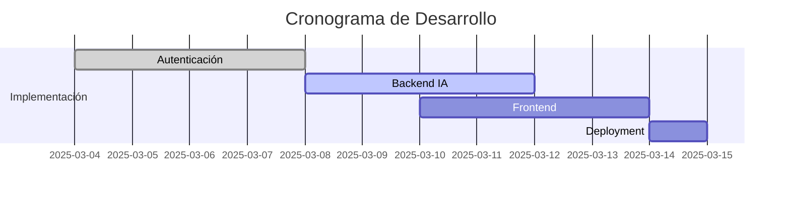

# IA Chat App with LangChain 🔥🚀

Aplicación de chat inteligente con capacidades de IA utilizando LangChain, base para proyectos posteriores.

## 🛠️ Requerimientos Técnicos

- **Bases de Datos:**
  - 🍃 MongoDB (Almacenamiento principal)
  - 🧠 Redis (Cache y sesiones)
- **Dependencias Clave:**
  - [menloltd/cortex](https://github.com/menloltd/cortex) (Procesamiento de IA)
  - LangChain (Flujos conversacionales)
  - Next.js (Frontend)

## 📌 Plan de Implementación

| Etapa                       | Estado         | Detalle                        |
| --------------------------- | -------------- | ------------------------------ |
| 1. Sistema de Autenticación | ✅ Completado  | Login con JWT y OAuth 2.0      |
| 2. Núcleo de IA             | 🚧 En Progreso | Integración LangChain + Cortex |
| 3. Diseño de Interfaces     | ⏳ 30%         | Sistema de Chat Responsivo     |
| 4. Deployment               | 🗓️ Pendiente   | Configuración Vercel           |

## 📅 Cronograma

## 🔍 Referencias Clave

- [Documentación LangChain](https://langchain.com/docs)
- [Arquitectura Cortex](https://hub.docker.com/r/menloltd/cortex)
- [cortex-plataforma-de-la-ia-albertcoronado](https://www.albertcoronado.com/2024/12/03/cortex-plataforma-de-ia-para-desplegar-llms-en-local)

## 🚀 Cómo Contribuir

1. Clona el repositorio
2. Instala dependencias: `npm install`
3. Configura variables de entorno (.env)
4. Inicia servidores: `docker-compose up -d`
5. Ejecuta la app: `npm run dev`
